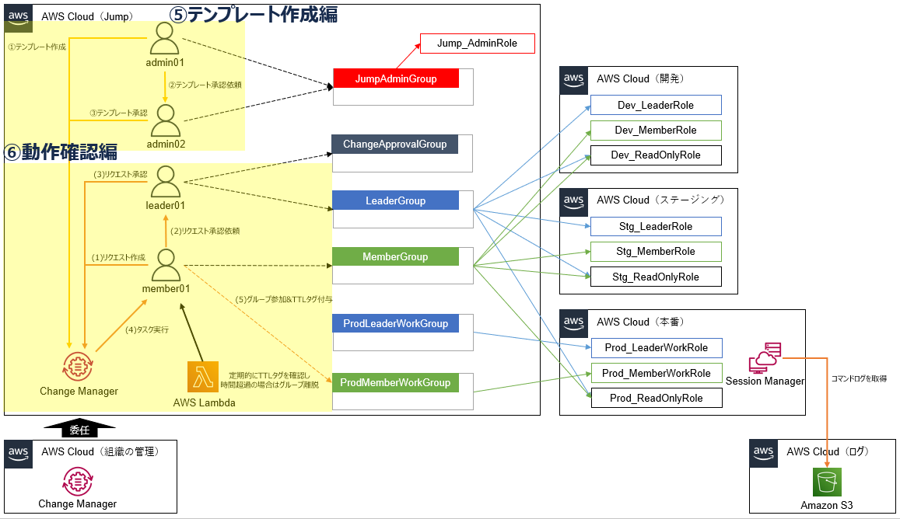

# access-control-with-aws-systems-manager-change-manager
AWS Systems Manager Change Managerによる変更管理と本番アクセス統制のCloudFormationテンプレートです。

## 概要
AWS Systems Manager Change Manager はアプリやインフラの変更管理を提供するものです。  
この機能を応用することで、権限付与を管理することができます。  
具体的には、本番環境にスイッチロールできる IAM グループに対し、申請と承認によってグループへの追加と削除することで実現しています。  
また、グループからの離脱申請を忘れたときの対策として、TTL監視用Lambda関数も用意しています。

## 各種ファイル

| ファイル名 | 説明 |
| ------------- | ------------- |
| AddUserToGroup-automation.yaml | グループ参加用ドキュメント |
| AddUserToGroup-template.yaml | グループ参加用テンプレート |
| RemoveUserFromGroup-automation.yaml | グループ離脱用ドキュメント |
| RemoveUserFromGroup-template.yaml | グループ離脱用テンプレート |
| jump-chengemanager-lambda-checkgroup.py | TTL監視用Lambda関数 |

## 使い方

[こちらのブログ](https://yuj1osm.hatenablog.com/entry/2025/01/12/163136)を参考にしてください。